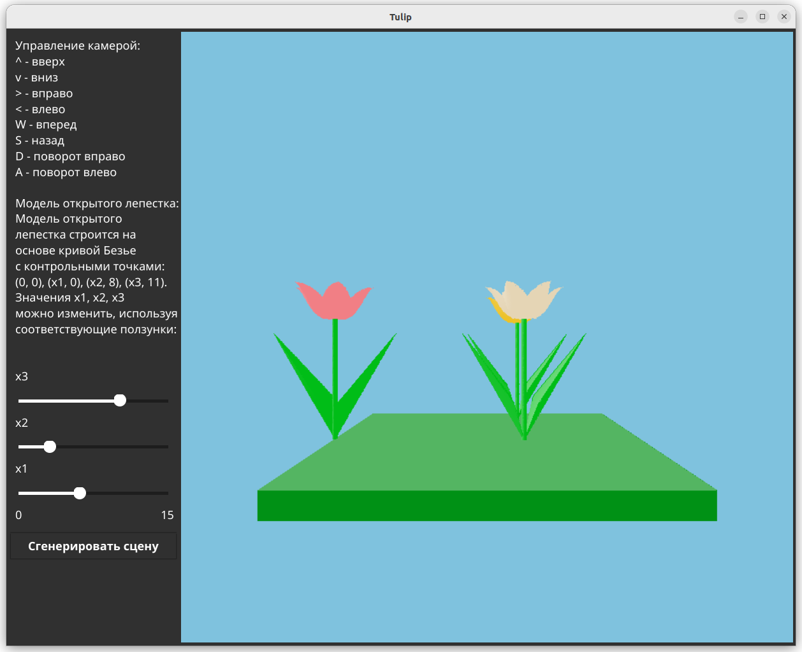

# Tulip
My final project for computer graphics course at BMSTU. 3D rendering from scratch (CPU). 

Program renders an animation of tulips during the day. Tulips open and close in response to light, which simulates the sun.

Different petal shapes and camera positions:

